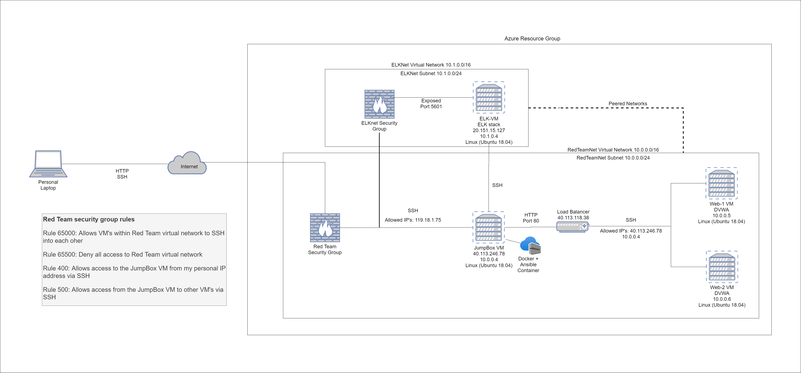
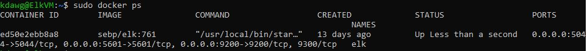

## Automated ELK Stack Deployment

The files in this repository were used to configure the network depicted below.



These files have been tested and used to generate a live ELK deployment on Azure. They can be used to either recreate the entire deployment pictured above. Alternatively, select portions of the ansible_playbook.yml file may be used to install only certain pieces of it, such as Filebeat.

````linux
- name: installing and launching filebeat
  hosts: webservers
  become: yes
  tasks:

  - name: download filebeat deb
    command: curl -L -O https://artifacts.elastic.co/downloads/beats/filebeat/filebeat-7.4.0-amd64.deb

  - name: install filebeat deb
    command: dpkg -i filebeat-7.4.0-amd64.deb

  - name: drop in filebeat.yml
    copy:
      src: /etc/ansible/files/filebeat-config.yml
      dest: /etc/filebeat/filebeat.yml

  - name: enable and configure system module
    command: filebeat modules enable system

  - name: setup filebeat
    command: filebeat setup

  - name: start filebeat service
    command: service filebeat start
````

This document contains the following details:
- Description of the Topology
- Access Policies
- ELK Configuration
  - Beats in Use
  - Machines Being Monitored
- How to Use the Ansible Build


### Description of the Topology

The main purpose of this network is to expose a load-balanced and monitored instance of DVWA, the D*mn Vulnerable Web Application.

Load balancing ensures that the application will be highly responsive, in addition to restricting access to the network.
- Load balancing protects a network from distributed denial of service attacks (DDoS) by altering attack traffic from a private server to a public cloud server. A jump box has the added advantage of improving security by providing an extra layer between the private server and the target network.

Integrating an ELK server allows users to easily monitor the vulnerable VMs for changes to the network logs and system traffic.
- Filebeat watches for log files on your server and sends the collected data to Elasticsearch.
- Metricbeat records metrics from the host system and also sends the data to Elasticsearch.

The configuration details of each machine may be found below.

| Name     | Function | IP Address | Operating System |
|----------|----------|------------|------------------|
| Jump-Box-Provisioner | Gateway  | 10.0.0.4   | Linux            |
| Web-1    | Web server   | 10.0.0.5   | Linux            |
| Web-2    | Web server   | 10.0.0.6   | Linux            |
| ELK-VM   | ELK stack  | 10.1.0.4   | Linux            |

### Access Policies

The machines on the internal network are not exposed to the public Internet. 

Only the Jump-Box-Provisioner machine can accept connections from the Internet. Access to this machine is only allowed from the following IP address:
- my IP address

Machines within the network can only be accessed by SSH from the Jump-Box-Provisioner.
- Jump-Box-Provisioner was allowed access to the ELK-VM. It's IP address was 10.0.0.4.

A summary of the access policies in place can be found in the table below.

| Name     | Publicly Accessible | Allowed IP Addresses |
|----------|---------------------|----------------------|
| Jump-Box-Provisioner | Yes              | my IP address    |
| Web-1   |  No                   |  10.0.0.4             |
|  Web-2        |    No                 |   10.0.0.4       |
| ELK-VM          |       No              |  my IP address, 10.0.0.4     |

### Elk Configuration

Ansible was used to automate configuration of the ELK machine. No configuration was performed manually, which is advantageous because multiple servers can be deployed in a short space of time using a single playbook, making it very time efficient and minimising human error.

The playbook implements the following tasks:
- Install Docker _TODO: In 3-5 bullets, explain the steps of the ELK installation play. E.g., install Docker; download image; etc._
- Install Python
- Install Docker container
- Increase virtual memory
- Download and launch docker ELK container

The following screenshot displays the result of running `docker ps` after successfully configuring the ELK instance.



### Target Machines & Beats
This ELK server is configured to monitor the following machines:
- Web-1: 10.0.0.5
- Web-2: 10.0.0.6

We have installed the following Beats on these machines:
- Filebeat
- Metricbeat

These Beats allow us to collect the following information from each machine:
- Filebeat collects log files which we use to monitor the system and changes to different files.
- Metricbeat collects metrics and statistics from a machine which we use to monitor if a system is running smoothly and where its faults are if not.

### Using the Playbook
In order to use the playbook, you will need to have an Ansible control node already configured. Assuming you have such a control node provisioned: 

SSH into the control node and follow the steps below:
- Copy the filebeat-config file to Web-1 and Web-2 in /etc/filebeat.
- Update the hosts file to include the Web-1, Web-2 and ELK-VM IP addresses. 
- Run the playbook, and navigate to the Filebeat installation page on the ELK server GUI (Kibana) to check that the installation worked as expected.
